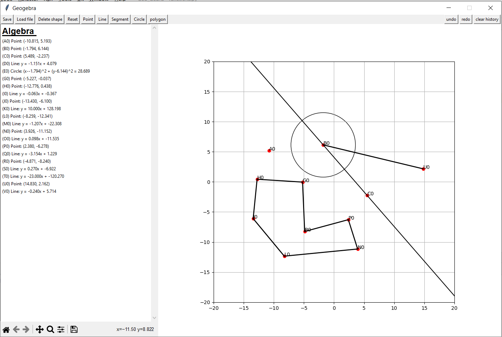

# Geo-Gebra

## Introduction
GeoGebra is a mathematical UI software that integrates geometry, algebra, and calculus. 
It allows users to explore mathematical concepts through dynamic visualizations, making it an invaluable tool for students, teachers, and professionals alike.
Our contribution is to translation of GeoGebra from Java to Python.

## features
### Draw / Delete
Our GUI is able to handle inputs of data, Draw it and Delete.  
Current shapes availables:  
Point, Line, Circle and others.   
Each shape have those following features:  
   Label - Represent the shape in the text and also on the figure.  
   Drag - Each shape can be drag from it place, the label will change as follow.  
   Hide - hide the object from the figure but not from the list of shapes (not as delete).  

### Undo / Redo
In our program, all kind of operaiton are saved. 
The Undo and Redo works in this way: 
Undo take an operation that has occurred and do the opposite one to undo it, 
and the Redo simply take an operation and do it as is. 

### Reset / delete history
Reset is the abilit to reset the figure from shape (and it's included as operation that we can Undo or Redo) 
Delete history simply delete all the operations from the history s.t you can't restore anymore and it is initialize (but save the shapes already drawn) 

### Save / Load
Save the current poisition of the figure with all the shaped on it. 
Load from file a position and continue from there. 

## platform
Our Gui use two main classes: 
   1) matplotlib - to display information on the grids (such as plotting shapes). 
   2) tkinter - to display all the wrraper information (such as equalitions, buttons and other features). 

## How to use it?
clone our project, and simply run with python the class 'geogebrah_interface.py' and start explore.

## Original Java based project
https://github.com/geogebra/geogebra.git

