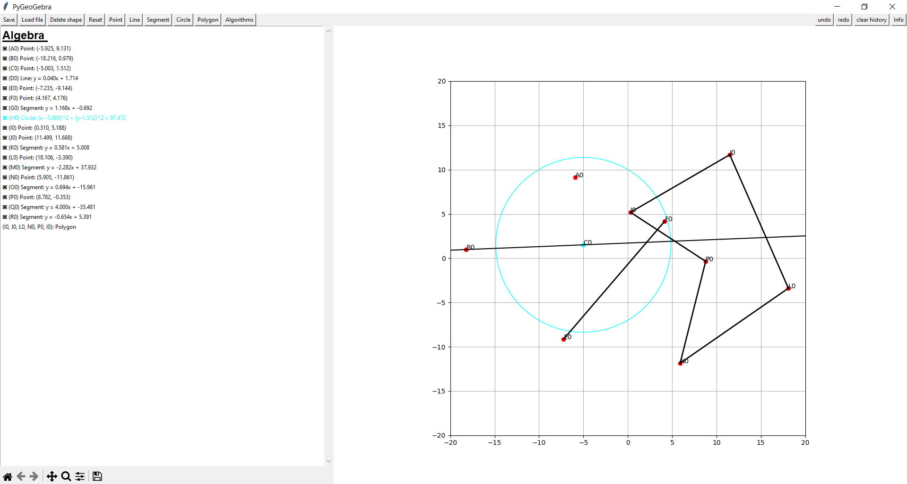

# PyGeoGebra

A Python reimplementation of [GeoGebra](https://www.geogebra.org/) — an interactive geometry canvas with algebra, algorithms, and file persistence. Built with **matplotlib** for the canvas and **tkinter** for the UI.



---

## Features

### Drawing Tools
| Tool | Description |
|------|-------------|
| **Point** | Click anywhere to place a labelled point |
| **Line** | Click two points (or existing points) to draw an infinite line |
| **Segment** | Click two points to draw a bounded segment |
| **Circle** | Click center then radius to draw a circle |
| **Polygon** | Click vertices, then click the first point again to close |

### Interaction
- **Drag** — click and drag any shape to move it; labels update in real time
- **Hide / Show** — right-click a label in the Algebra panel to toggle visibility
- **Delete** — toolbar button or `Delete` key after selecting a shape
- **Select** — left-click a shape on the canvas or in the Algebra panel to highlight it

### Algebra Panel
Live equation view on the left — every shape's equation or coordinates update as you move things.

### Algorithms Panel
Click **⚙ Algorithms** to open the panel. Select a shape and algorithm:
- **Perimeter** — total edge length
- **Area** — enclosed area (polygons and circles)
- **Convex Hull** — Graham scan on polygon vertices
- **Triangulation** — Delaunay triangulation on polygon vertices

### History
| Action | Shortcut |
|--------|----------|
| Undo | `Ctrl+Z` or toolbar button |
| Redo | `Ctrl+Y` or toolbar button |
| Clear history | toolbar button (keeps shapes, clears undo stack) |

### File Operations
- **Save** — persists the canvas to a `.p` (pickle) file
- **Load** — restores a saved canvas, replacing the current one

### Info Panel
Click **ℹ Info** to view a description and reference image for each shape type.

---

## Installation

### Prerequisites
- Python 3.9+ with tkinter support
- On macOS (Homebrew): `brew install python-tk@3.12`
- On Ubuntu/Debian: `sudo apt install python3-tk`
- On Windows: tkinter is bundled with the official Python installer from [python.org](https://www.python.org/downloads/)

### Setup

```bash
# 1. Clone the repo
git clone https://github.com/HILLELOH/Project_Geo_Gebra.git
cd Project_Geo_Gebra

# 2. Create and activate a virtual environment
python3 -m venv venv
source venv/bin/activate        # macOS / Linux
# venv\Scripts\activate         # Windows

# 3. Install dependencies
pip install -r requirements.txt

# 4. Run
python PyGeoGebra.py
```

---

## Project Structure

```
PyGeoGebra/
├── main.py                   # Application entry point
├── PyGeoGebra.py             # Launcher (calls main.py)
├── config.py                 # Global application state
├── label_generator.py        # Alphanumeric label generator (A0, B0 … Z0, A1 …)
│
├── Shapes/                   # Geometry primitives
│   ├── shapes.py             # Base Shape class
│   ├── Point.py
│   ├── Line.py
│   ├── Segment.py
│   ├── Circle.py
│   ├── Polygon.py
│   └── Triangle.py
│
├── app/                      # Application logic (separated by concern)
│   ├── ui/
│   │   ├── styles.py         # Colour theme and font constants
│   │   ├── panels.py         # SidePanel widget
│   │   ├── toolbar.py        # Toolbar button factory
│   │   ├── dialogs.py        # Info window, coordinate-input dialog
│   │   └── algo_panel.py     # Algorithms panel
│   ├── canvas/
│   │   ├── renderer.py       # update_display(), update_label()
│   │   └── events.py         # Mouse/keyboard/scroll event handlers
│   ├── commands/
│   │   ├── operations.py     # draw_shape(), delete_by_label(), reset_canvas()
│   │   └── history.py        # undo(), redo(), clear_history()
│   ├── io/
│   │   └── persistence.py    # save(), load()
│   └── algorithms.py         # Convex hull, triangulation
│
├── Info/                     # Shape description text files
├── Images/                   # Shape reference images
├── tests/                    # Test suite
│   ├── test_shapes.py
│   ├── test_label_generator.py
│   └── test_algorithms.py
└── requirements.txt
```

---

## Running Tests

```bash
python -m pytest tests/ -v
# or without pytest:
python -m unittest discover tests/
```

---

## Open Source

PyGeoGebra is released under the **MIT License** — see [LICENSE](LICENSE).

This project is a Python reimplementation inspired by [GeoGebra](https://github.com/geogebra/geogebra) (Java). GeoGebra is a separate project under its own license and is not affiliated with this repository.

### Contributing

1. Fork the repository
2. Create a feature branch: `git checkout -b feature/my-feature`
3. Commit your changes: `git commit -m "Add my feature"`
4. Push and open a Pull Request

Bug reports and feature requests are welcome via [GitHub Issues](https://github.com/HILLELOH/Project_Geo_Gebra/issues).

---

## Dependencies

| Package | Purpose |
|---------|---------|
| [matplotlib](https://matplotlib.org/) | Canvas rendering and interactive plot events |
| [scipy](https://scipy.org/) | Convex hull (Graham scan) and Delaunay triangulation |
| [Pillow](https://python-pillow.org/) | Image loading in the Info panel |
| [colorama](https://github.com/tartley/colorama) | Cross-platform terminal colour output |
